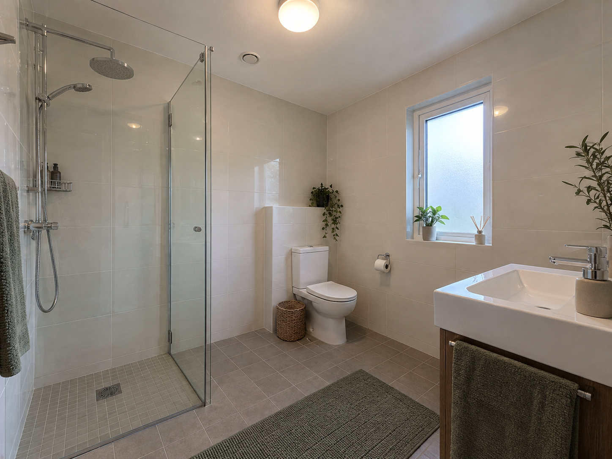
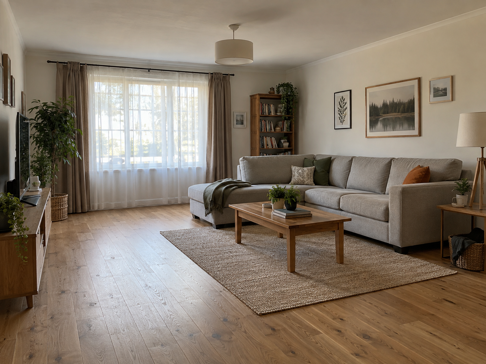
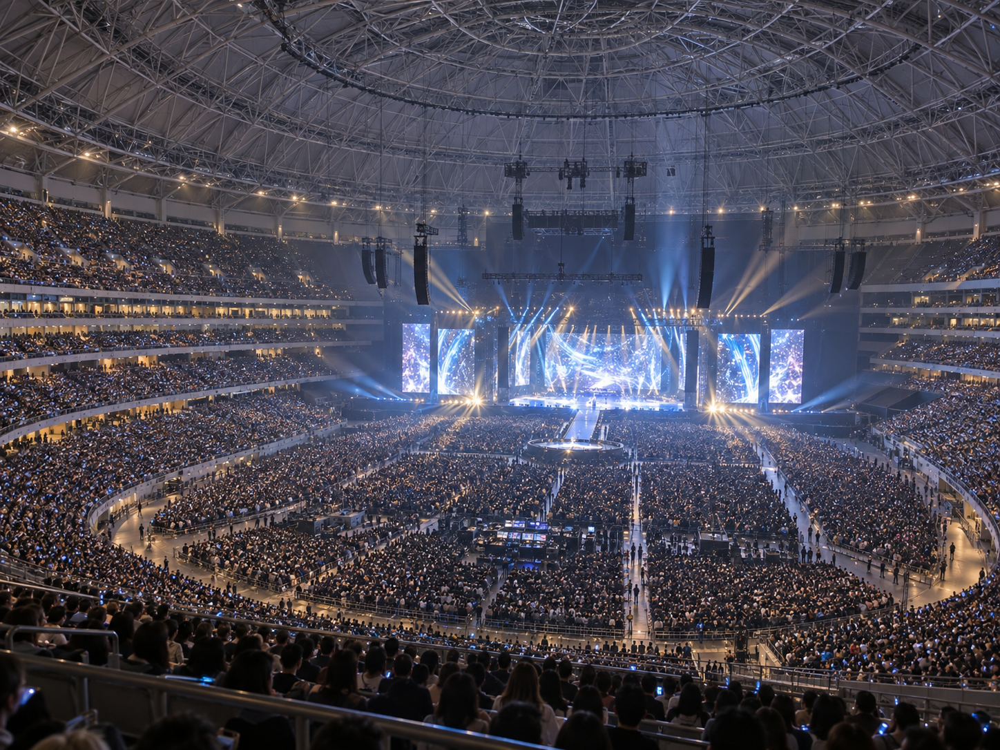
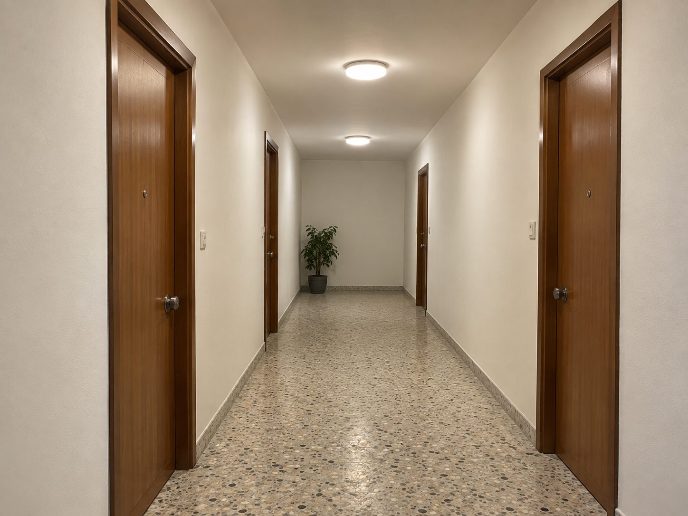
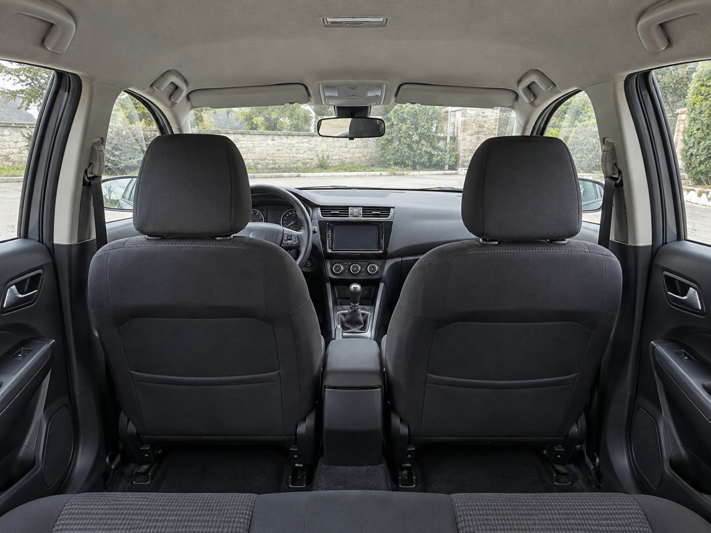
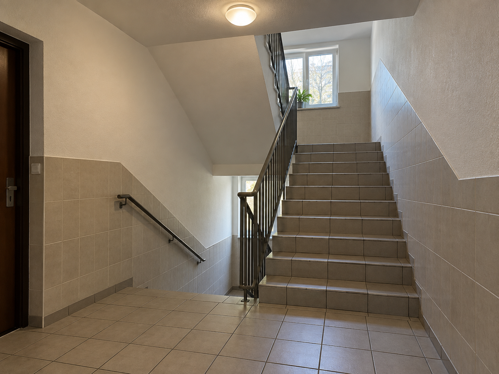
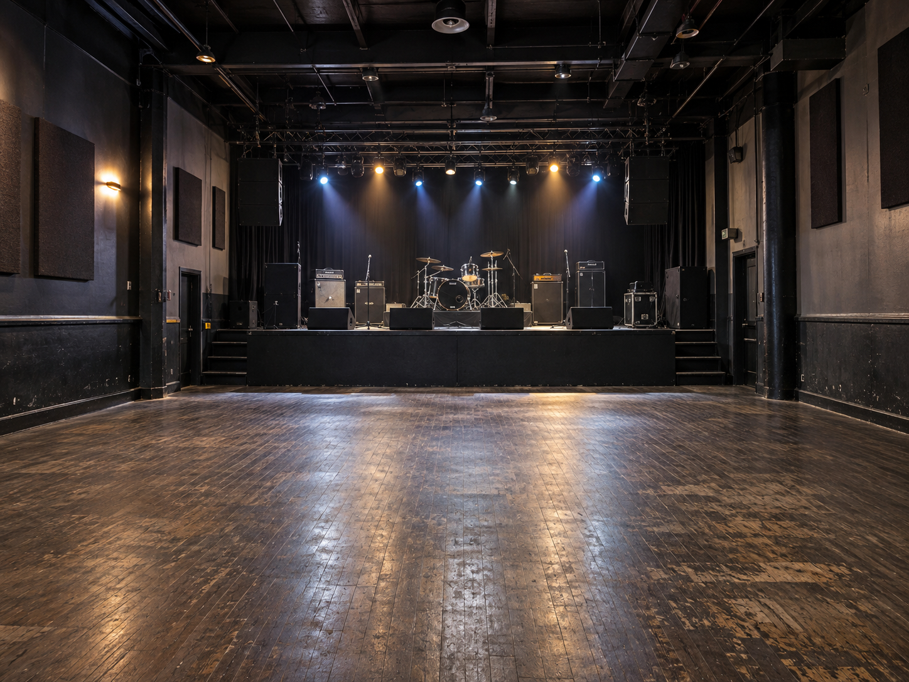
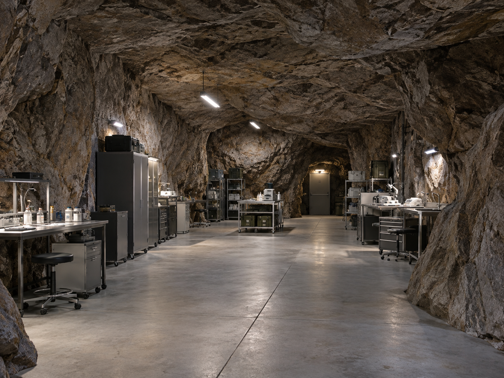
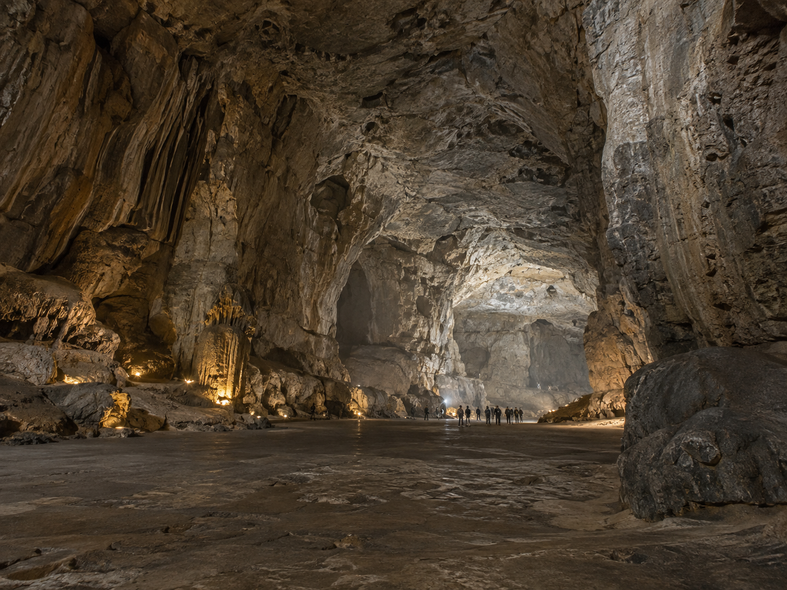

# T-04 場景需求與照片替換（2026-09-20）

## 需求分析

T-04 原卡要求至少五張，涵蓋浴室、客廳、教堂／大空間、樓梯間／走廊、車內。沒有另訂照片解析度下限。另需至少三組真實 IR 與同場地照片配對；這部分不能由 GPT Image 取代，本次保留原八組。

T-17-R2 已生成的五張候選圖恰好覆蓋全部基本類別，初輪未重生基本場景；使用者後續指定體育館須為大型演唱會巨蛋，因此大空間已另生成替換。原九張中的另四張（樓梯間、Live House、洞窟實驗室、巨型洞窟）補生成，保留補充測試覆蓋。客廳取代原先臥室代用品；大空間現採大型演唱會巨蛋體育館，禮堂版本已備份。

## 巨蛋版本更新

使用者指定體育館呈現大型演唱會巨蛋：高層看台視角、完整鋼構穹頂、多層環繞觀眾席、滿場觀眾、大舞台與吊掛音響。內建 GPT Image 重新生成，目視符合；1448×1086、可解碼。完整提示詞見 [ARENA_PROMPT.json](ARENA_PROMPT.json)。現行總數九張＝四張沿用＋五張新生成；R2 原禮堂圖不變。

## 替換清單

| 舊檔 | 現行檔 | 場景 | 處理 |
|---|---|---|---|
| `bathroom_tiled.png` | [t04_gpt_bathroom.png](../photos/t04_gpt_bathroom.png) | 浴室 | 沿用 R2 合成候選 |
| `bedroom_ai_generated.png` | [t04_gpt_living.png](../photos/t04_gpt_living.png) | 客廳 | 沿用 R2 合成候選 |
| `arena_ntsu_linkou.png` | [t04_gpt_arena_concert.png](../photos/t04_gpt_arena_concert.png) | 巨蛋體育館／大型演唱會 | 後續依使用者指定新生成 |
| `corridor_hotel_carpet.png` | [t04_gpt_corridor.png](../photos/t04_gpt_corridor.png) | 走廊 | 沿用 R2 合成候選 |
| `car_interior_suv.png` | [t04_gpt_car.png](../photos/t04_gpt_car.png) | 車內 | 沿用 R2 合成候選 |
| `stairwell_tiled.png` | [t04_gpt_stairwell.png](../photos/t04_gpt_stairwell.png) | 樓梯間 | 本次 GPT Image 新生成 |
| `livehouse_riverside_ximen.png` | [t04_gpt_livehouse.png](../photos/t04_gpt_livehouse.png) | Live House | 本次 GPT Image 新生成 |
| `cgi_cave_lab_sophy.png` | [t04_gpt_cave_lab.png](../photos/t04_gpt_cave_lab.png) | 洞窟實驗室 | 本次 GPT Image 新生成 |
| `cgi_cavern_crowd_sophy.png` | [t04_gpt_cavern_crowd.png](../photos/t04_gpt_cavern_crowd.png) | 巨型洞窟 | 本次 GPT Image 新生成 |

## 來源與檢查

使用內建 GPT Image / image_gen，無外部照片輸入，非 API／CLI。初輪四張新圖的完整實際提示詞見 [PROMPTS.json](PROMPTS.json)；初輪五張沿用圖的提示詞见 [原生成紀錄](../t17r2_synthetic_candidates/PROMPTS.json)。不宣稱真實攝影或第三方圖庫授權。

九張皆 1448×1086 PNG、4:3、可完整解碼；未裁切或放大。現行四張沿用圖與來源 SHA-256 完全一致；九張原圖備份指紋全部相符，詳見 [ASSET_MANIFEST.json](ASSET_MANIFEST.json)。目視：場景可辨、非全景、無播放器 UI／字幕／外框；Live House 偏暗並有微小器材字樣，洞窟群眾圖有遠處小人物，車艙地面受座椅遮擋。這些是可見特性，不作材質真值。

## 歷史與使用界線

舊圖移至本機 `assets/photos_legacy_20260920/`（git 忽略）；也可從 manifest 記錄的 historical_commit 取得。現行照片使用全新檔名，防止舊標註按檔名誤接新像素。既有 ground truth、凍結 manifest、baseline 與驗收報告均不改；它們仍對應原始照片。固定引用舊照片的歷史腳本，需使用原版 checkout 和原素材，不能直接在更新後照片集重現原判定。

初輪沿用到 T-04 的五張 R2 候選圖從此屬共用開發素材；若後續用於調參、標註或校準，便不再具 held-out 資格。其原生長邊 1448px 仍未達 R2 的 1920px 門檻。合成圖未取得真實尺寸／六面材質確認，不能代替真實 IR 配對照片。

T-04 工程維持未結案（歷史来源缺項不藉換圖抹除）；本次素材替換自檢完成、待審。實驗：未執行；產品：不適用；MVP：不適用（首驗 FAIL 不變）。本次沒有跑影像模型、產 IR 或進行 R2 驗收。

## 九張現行照片預覽

### 浴室

### 客廳

### 巨蛋體育館／大型演唱會

### 走廊

### 車內

### 樓梯間

### Live House

### 洞窟實驗室

### 巨型洞窟

> 📌 **2026-09-20 Fable 補**：上文「其原生長邊 1448px 仍未達 R2 的 1920px 門檻」是舊門檻下的紀錄；門檻已改為長邊 ≥1280px（TASKS.md T-17-R2 卡裁定 T-17-R2-S）。四張沿用圖（＋已移到 `assets/photos_legacy_20260920/` 的 `t04_gpt_hall.png`）受共用圖禁用令約束（T-04 卡裁定 T-04-R §2 第 4 點）。
> T-04 v2 的判定以獨立 Opus 依裁定 T-04-R 驗證為準；本檔的「素材替換自檢完成」不算 v2 判定。

> 🔓 **2026-09-21 Fable 補（另起新段；上文原文保留）**：共用圖禁用令已於 `121697a` 解除（TASKS.md T-04 卡裁定 T-04-R §2 第 4 點下方的解除紀錄）。四張沿用圖與 `t04_gpt_hall.png` 自此是一般開發素材，但不再具 held-out 資格。`assets/photos_legacy_20260920/` 仍不得刪。
